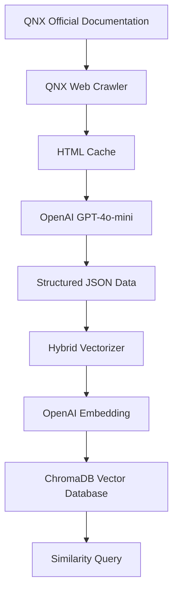

# QNX Glue Code Generator

An AI-based QNX to Linux function migration system that supports automatic crawling of QNX official documentation, structured data extraction, and vectorized storage.

## 🚀 System Features

- **Intelligent Crawler**: Automatically crawls function documentation from QNX official website
- **AI Extraction**: Uses OpenAI GPT-4o-mini for structured JSON data extraction
- **Hybrid Vectorization**: Supports OpenAI embedding, stable and reliable
- **Vector Database**: Efficient storage and querying based on ChromaDB
- **Batch Processing**: Efficiently processes large volumes of QNX function documentation

## 📁 Project Structure

```
gen_code_v2/
├── 🔧 Core Modules
│   ├── qnx_batch_processor.py          # Main batch processor
│   ├── qnx_web_crawler.py              # QNX web crawler
│   ├── openai_json_extractor.py        # JSON data extractor
│   └── hybrid_vectorizer.py            # Hybrid vectorizer
│
├── ⚙️ Configuration Files
│   ├── config.json                     # System configuration
│   ├── requirements.txt                # Python dependencies
│   ├── .env.example                    # Environment variable template
│   └── .env                           # API key configuration
│
├── 📚 Documentation
│   ├── README.md                       # Project description
│   ├── SETUP_GUIDE.md                  # Installation and setup guide
│   ├── OPENAI_INTEGRATION.md           # OpenAI integration documentation
│   └── architecture.md                 # System architecture documentation
│
├── 🧪 Test Directory  
│   ├── test_qnx_system.py              # Comprehensive system tests
│   └── test_openai_json_extractor.py   # JSON extractor tests
│
├── 🛠️ Utility Scripts
│   ├── analyze_qnx_structure.py        # Documentation structure analysis
│   └── qnx_full_index.py              # Complete index building
│
└── 📦 Data Directory
    ├── qnx_web_cache/                  # Web page cache
    ├── processed_functions/             # Processing results
    └── chroma_db/                      # Vector database
```

## 🏗️ System Architecture



## 🚀 Quick Start

### 1. Environment Setup

```bash
# Install dependencies
pip install -r requirements.txt

# Configure API keys
cp .env.example .env
# Edit .env file and add your API keys
```

### 2. API Key Configuration

Configure in `.env` file:
```bash
OPENAI_API_KEY=your_openai_api_key
```

### 3. Run Tests

```bash
# Run comprehensive tests
python tests/test_qnx_system.py

# Test API status
python tests/test_qnx_system.py
```

### 4. Batch Processing

```bash
# Process specific functions
python qnx_batch_processor.py --functions abort malloc printf --output my_functions.json

# Process all A-Z functions (complete crawl)
python qnx_batch_processor.py --all --output all_qnx_functions.json

# Process functions for specific letters
python qnx_batch_processor.py --letters a b c --output abc_functions.json

# Limit processing count
python qnx_batch_processor.py --all --max-functions 100 --output limited_functions.json

# Process and test query
python qnx_batch_processor.py --letters m --test-query "memory allocation" --output memory_funcs.json
```

## 💡 使用示例

### 基本批量处理
```python
from qnx_batch_processor_final import QNXBatchProcessorFinal

# 初始化处理器
processor = QNXBatchProcessorFinal()

# 处理函数列表
functions = ["abort", "malloc", "printf", "strlen"]
result = processor.process_functions(functions, "output.json")

print(f"处理成功: {result['stats']['stored']}/{result['stats']['total_functions']}")
```

### 查询相似函数
```python
# 查询相似函数
results = processor.query_functions("内存分配函数", n_results=5)
for result in results:
    print(f"{result['function_name']}: {result['similarity']:.3f}")
```

## 🔧 配置说明

### config.json
```json
{
  "ai_settings": {
    "openai": {
      "chat_model": "gpt-4o-mini",
      "embedding_model": "text-embedding-3-small",
      "batch_size": 16,
      "max_tokens": 4000,
      "temperature": 0.1
    }
  }
}
```

## 📊 Processing Result Format

```json
{
  "abort": {
    "function_data": {
      "name": "abort",
      "synopsis": "#include <stdlib.h>\\nvoid abort( void );",
      "description": "Abnormally terminates program execution...",
      "parameters": [],
      "return_type": "void",
      "headers": [{"filename": "stdlib.h", "is_system": true}],
      "examples": ["..."],
      "see_also": ["exit()", "atexit()"]
    },
    "embedding": [0.014, 0.048, ...],
    "has_embedding": true
  }
}
```

## 🛡️ API Management

The system uses OpenAI API for:
- **GPT-4o-mini**: JSON data extraction, stable and reliable
- **text-embedding-3-small**: Vectorization, high-quality embeddings

OpenAI API provides stable service quality, avoiding quota limitation issues.

## 🔍 Troubleshooting

### Common Issues

1. **OpenAI API Error**
   ```
   Error: Invalid API key provided
   ```
   Solution: Check OPENAI_API_KEY setting in .env file

2. **Module Import Error**
   ```
   ImportError: No module named 'openai'
   ```
   Solution: `pip install openai`

3. **Vector Database Permission Error**
   ```
   PermissionError: Permission denied: './data/chroma_db'
   ```
   Solution: `chmod -R 755 ./data`

### Debug Mode

```python
import logging
logging.basicConfig(level=logging.DEBUG)
```

## 📈 Performance Recommendations

- **Concurrency Settings**: Adjust max_workers based on hardware (recommended 4-8)
- **Batch Size**: Set embedding batch_size to 10-32
- **Cache Management**: Regularly clean expired cache files
- **API Limits**: Pay attention to rate limits of various APIs

## 🤝 Contributing Guide

1. Fork the project
2. Create a feature branch
3. Commit your changes
4. Push to the branch
5. Create a Pull Request

## 📄 License

This project is licensed under the MIT License.

## 🔗 Related Links

- [QNX Official Documentation](https://www.qnx.com/developers/docs/7.1/)
- [OpenAI API Documentation](https://platform.openai.com/docs)
- [ChromaDB Documentation](https://docs.trychroma.com/)